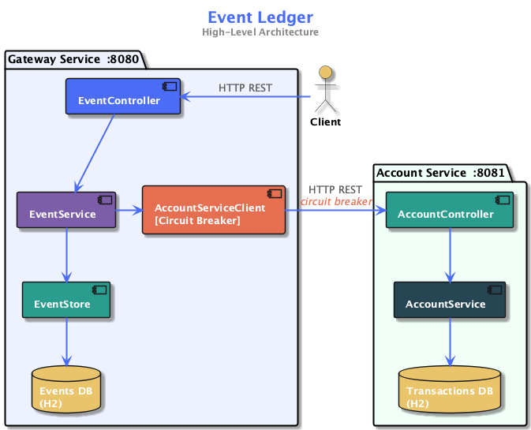
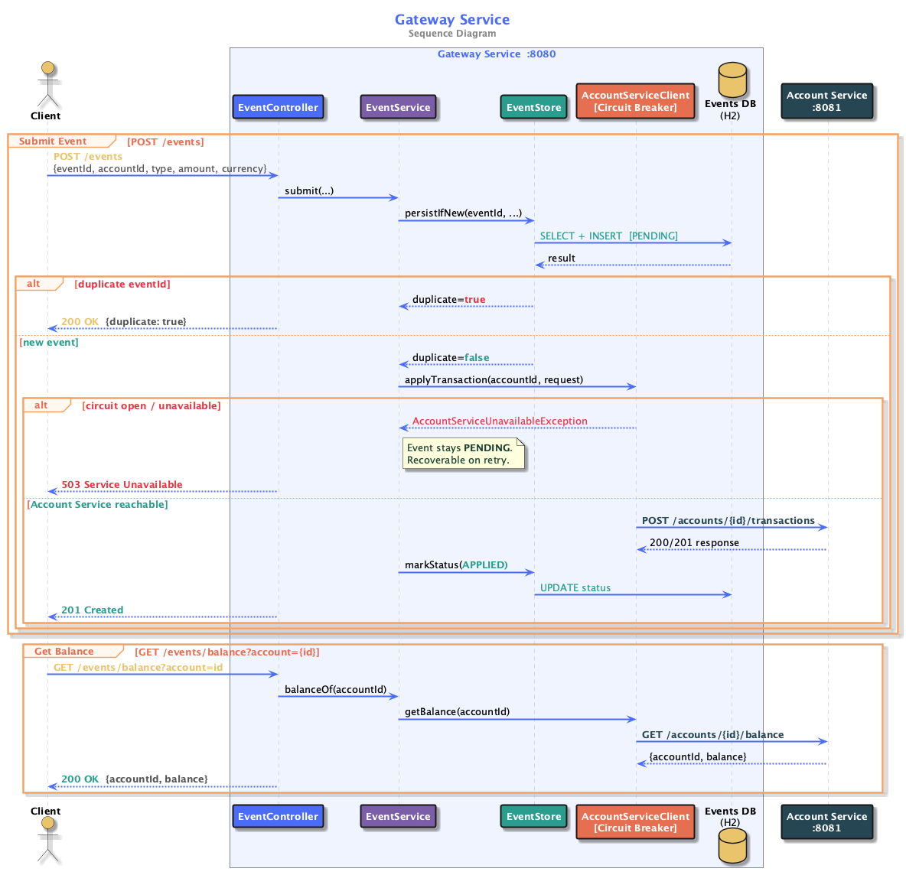
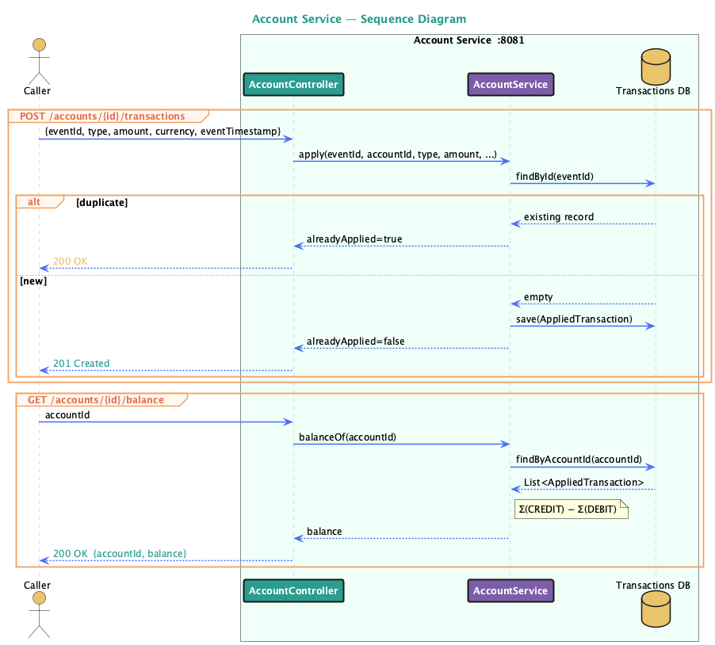
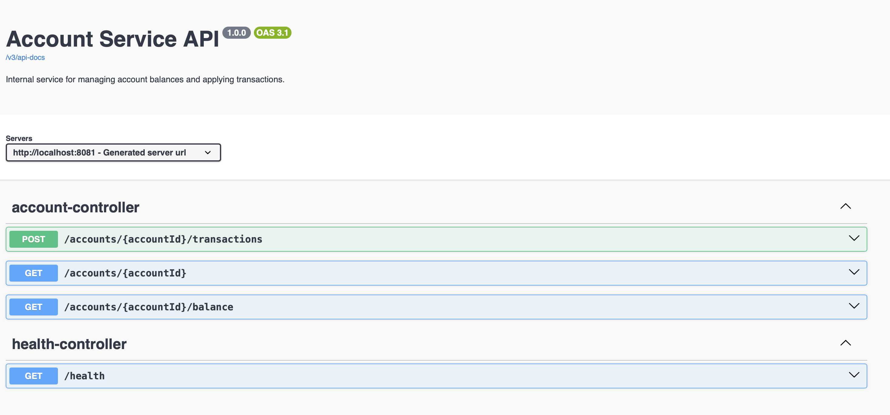
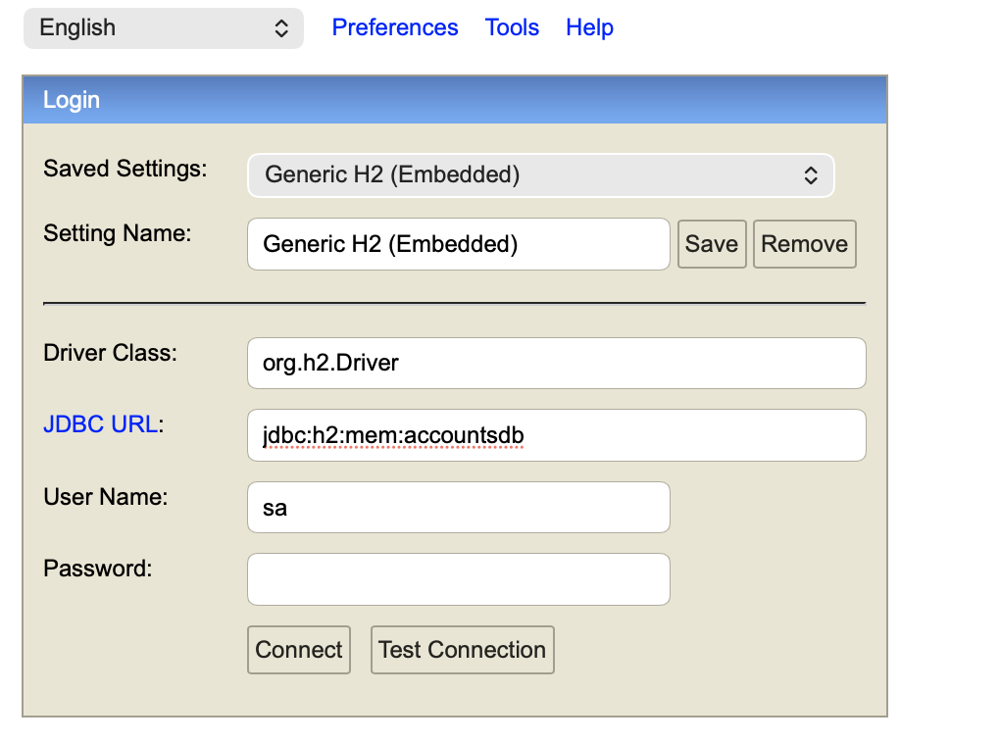
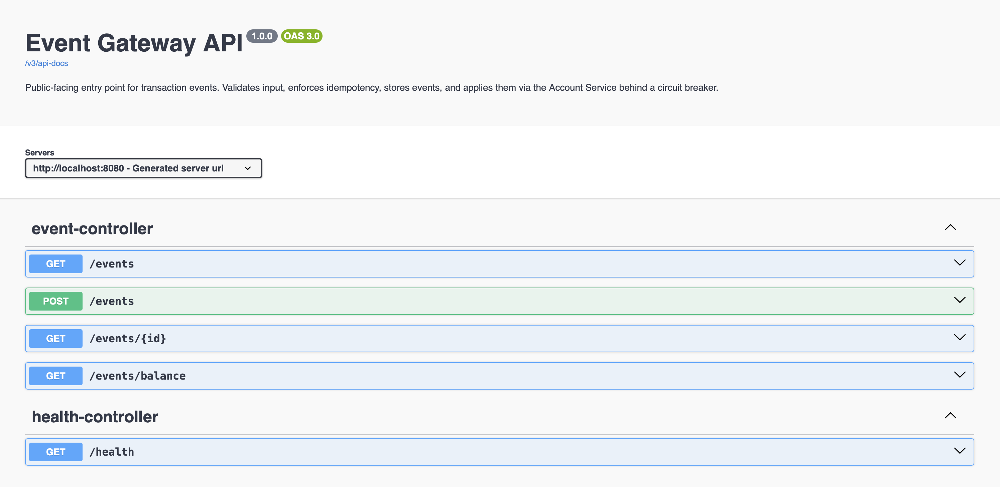

# Event Ledger

A distributed system composed of two microservices that process financial transaction events with idempotency, out-of-order tolerance, resiliency, and observability.

---

## Tech Stack

| Category   | Technology                      | Version               |
|------------|---------------------------------|-----------------------|
| Language   | Java                            | 21                    |
| Framework  | Spring Boot                     | 3.3.5                 |
| REST       | Spring Web MVC                  | Spring Boot managed   |
| HTTP Client| Spring WebFlux (WebClient)      | Spring Boot managed   |
| Persistence| Spring Data JPA + H2            | Spring Boot managed   |
| Validation | Spring Validation               | Spring Boot managed   |
| Resiliency | Resilience4j                    | 2.2.0                 |
| Tracing    | Micrometer Tracing (Brave)      | Spring Boot managed   |
| Metrics    | Micrometer + Spring Actuator    | Spring Boot managed   |
| Logging    | Logstash Logback Encoder        | 8.0                   |
| API Docs   | SpringDoc OpenAPI / Swagger UI  | 2.6.0                 |
| Testing    | JUnit 5 + Spring Boot Test      | Spring Boot managed   |
| Testing    | WireMock                        | 3.9.1                 |
| Build      | Maven                           | 3.x                   |

---

## Architecture



The system is split into two independent services:

### Gateway Service (`:8080`)
Public-facing entry point. Accepts transaction events from clients, enforces idempotency, persists events locally, and forwards them to the Account Service.

| Method | Endpoint | Description |
|--------|----------|-------------|
| `POST` | `/events` | Submit a transaction event |
| `GET`  | `/events/{id}` | Retrieve a single event by ID |
| `GET`  | `/events?account={accountId}` | List events for an account |
| `GET`  | `/events/balance?account={accountId}` | Get account balance |
| `GET`  | `/health` | Health check |

### Account Service (`:8081`)
Internal service. Manages account state — applies transactions and computes balances. Only called by the Gateway.

| Method | Endpoint | Description |
|--------|----------|-------------|
| `POST` | `/accounts/{accountId}/transactions` | Apply a transaction |
| `GET`  | `/accounts/{accountId}/balance` | Get current balance |
| `GET`  | `/accounts/{accountId}` | Get account details and recent transactions |
| `GET`  | `/health` | Health check |

---

## Sequence Diagrams

### Gateway Service Flow


### Account Service Flow


---

## Prerequisites

- Java 21
- Maven 3.x (or use the included `./mvnw` wrapper — no install needed)

---

## Running the Services

### Docker Compose (recommended)

Build both JARs first, then start both services with a single command:

```bash
# Build both JARs (from the repo root)
./mvnw package -DskipTests

# Start both services
docker compose up
```

| Service | URL |
|---------|-----|
| Gateway | `http://localhost:8080` |
| Account Service | `http://localhost:8081` |

The `docker-compose.yml` mounts the pre-built JARs into a `eclipse-temurin:21-jre` image for each service. The Gateway waits for the Account Service health check to pass before starting.

---

### Manual — Account Service
```bash
cd account-service
./mvnw spring-boot:run
```

| URL | Description |
|-----|-------------|
| `http://localhost:8081/swagger-ui/index.html` | Swagger UI — interactive API testing |
| `http://localhost:8081/v3/api-docs` | OpenAPI JSON spec |
| `http://localhost:8081/health` | Health check |
| `http://localhost:8081/h2-console` | H2 database console |



### Inspecting the Database (H2 Console)

Open `http://localhost:8081/h2-console` and connect with:

| Field | Value |
|-------|-------|
| JDBC URL | `jdbc:h2:mem:accountsdb` |
| Username | `sa` |
| Password | _(leave empty)_ |



Useful queries:
```sql
-- View all applied transactions
SELECT * FROM APPLIED_TRANSACTION;

-- Check balance for a specific account
SELECT ACCOUNT_ID,
       SUM(CASE WHEN TYPE = 'CREDIT' THEN AMOUNT ELSE -AMOUNT END) AS BALANCE
FROM APPLIED_TRANSACTION
GROUP BY ACCOUNT_ID;
```

### Manual — Gateway Service

```bash
cd gateway
./mvnw spring-boot:run
```

| URL | Description |
|-----|-------------|
| `http://localhost:8080/swagger-ui/index.html` | Swagger UI — interactive API testing |
| `http://localhost:8080/v3/api-docs` | OpenAPI JSON spec |
| `http://localhost:8080/health` | Health check (includes circuit breaker state) |
| `http://localhost:8080/h2-console` | H2 database console |
| `http://localhost:8080/actuator/metrics` | Micrometer metrics |

**H2 Console** (`http://localhost:8080/h2-console`):

| Field | Value |
|-------|-------|
| JDBC URL | `jdbc:h2:mem:eventsdb` |
| Username | `sa` |
| Password | _(leave empty)_ |


---

## Testing Manually via Swagger

### Gateway Service (`http://localhost:8080/swagger-ui/index.html`)



**Submit an event (`POST /events`):**
```json
{
  "eventId": "evt-001",
  "accountId": "acct-123",
  "type": "CREDIT",
  "amount": 150.00,
  "currency": "USD",
  "eventTimestamp": "2026-05-15T14:02:11Z",
  "metadata": {
    "source": "mainframe-batch",
    "batchId": "B-9042"
  }
}
```

**Verify idempotency** — submit the same `eventId` twice; second response returns `"duplicate": true` with HTTP 200.

---

### Account Service (`http://localhost:8081/swagger-ui/index.html`)

Once the Account Service is running, open `http://localhost:8081/swagger-ui/index.html` and try:

**Apply a transaction:**
```json
POST /accounts/{accountId}/transactions
{
  "eventId": "evt-001",
  "type": "CREDIT",
  "amount": 150.00,
  "currency": "USD",
  "eventTimestamp": "2026-05-15T14:00:00Z"
}
```

**Get balance:**
```
GET /accounts/{accountId}/balance
```

**Verify idempotency** — submit the same `eventId` twice, second response returns `alreadyApplied: true`.

---

## Running the Tests

### Account Service
```bash
cd account-service
./mvnw test
```

Covers:
- Idempotent transaction apply (duplicate `eventId` returns `200 alreadyApplied=true`)
- Balance computation — `Σ(CREDIT) − Σ(DEBIT)`
- Out-of-order tolerance — balance is correct regardless of arrival order
- Input validation — rejects negative amounts and unknown transaction types
- Health check

### Gateway Service

```bash
cd gateway
./mvnw test
```

Covers:
- Idempotency — duplicate `eventId` returns `200 duplicate=true` without re-applying
- Core endpoints — submit, get by ID, list by account
- Graceful degradation — GET endpoints work when Account Service is down
- Circuit breaker — opens after repeated Account Service failures
- Input validation — rejects missing fields, invalid type, negative amount
- Trace propagation — verifies B3 `X-B3-TraceId` header is forwarded to the Account Service
- Health check

---

## Resiliency Pattern

The Gateway uses a **circuit breaker** (Resilience4j) on all calls to the Account Service, combined with a **per-call timeout**.

### Why a circuit breaker?

The Account Service is a hard dependency for writes. If it starts failing, retrying every incoming request would:
- pile load on an already-struggling service
- tie up Gateway threads waiting on calls that are likely to fail anyway

The breaker detects a sustained failure rate (≥ 50% of the last 10 calls), **opens**, and then fails fast — every `POST /events` immediately returns `503` instead of hanging. After 5 seconds it lets a few trial calls through (half-open state) and closes once the service recovers.

### 4xx vs 5xx distinction

A downstream `4xx` means the request was bad, not that the service is unhealthy. `AccountServiceClientException` is raised for 4xx responses and is configured as an **ignored exception** in the breaker — a bad request does not count as evidence of a failing service. Only `5xx` responses, timeouts, and connection failures trip the breaker.

### Graceful degradation

Even with the circuit open:
- `GET /events/{id}` and `GET /events?account=...` still work — they read from the Gateway's own H2 database, which doesn't need the Account Service.
- `POST /events` stores the event locally as `PENDING` before attempting the Account Service call, so the event is preserved even if the downstream call fails.

---
